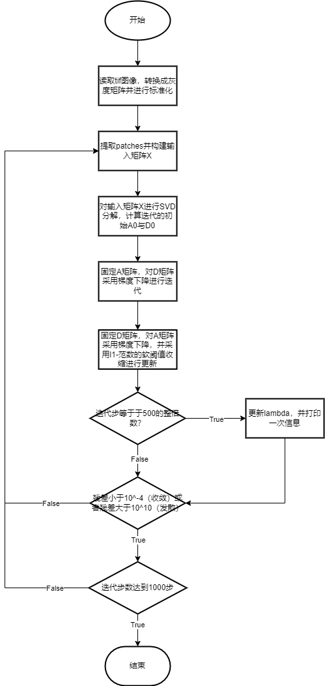

# Dictionary-Learning

这是一个基于 python 的字典学习程序

## Requirment

tiffile==2018.10.28

numpy==1.26.1

opencv-python==4.9.0

matplotlib==3.8.0

## Files

* model.py——迭代模型
* blackwhite.py——针对单通道黑白图像的处理程序
* RGB.py——针对3通道RGB图像的处理程序
* *_BL.tif——黑白图像样本（Lena、Cameraman、Barbara）
* *RGB.tif——彩色图像样本（Lena、Peppers、Baboon）

## Structure

